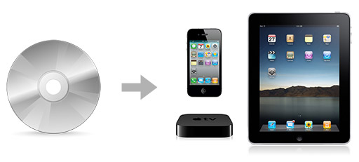

> Note: The guide below still applies, but you can now rip and convert Blu-Ray movies [_directly_ in Handbrake](https://www.macobserver.com/tmo/article/directly-rip-and-convert-bluray-disks-with-handbrake) if you download MakeMKV (don't even need to run it) then run the following commands in Terminal.app: `cd ~ mkdir -p ~/lib ln -s /Applications/MakeMKV.app/Contents/lib/libmmbd.dylib ~/lib/libaacs.dylib ln -s /Applications/MakeMKV.app/Contents/lib/libmmbd.dylib ~/lib/libbdplus.dylib` Also note that iDentify is no longer maintained; I usually use the free [MetaZ](https://griff.github.io/metaz/) application to edit metadata before importing into iTunes nowadays.

For many years, I've been in search of the 'digital nirvana,' where all my videos, songs, and photos were accessible on any device, anywhere, at any time, without having to do a complicated digital dance with wires and different sychronization tools.

I am getting ever closer to the realization of that dream... today I will introduce you to a few tools I use to help me get all my videos (be they plain old DVDs or newer high definition Blu-Ray discs \[edit: I found I can even rip HD-DVDs on my Mac too!\]) converted and stored on my computer so I can play them on my computer, my iPhone, my iPad, my Apple TV, my Xbox 360, a Playstation 3, and do so from anywhere in the world.

There are a few key applications you need before you can do this on your own - I'll describe the programs you need for each step of the process, and how to do everything you need to do to get your videos digitized and readily accessible.

### Ripping: Getting the Movies into Your Computer

The first step in the process is 'ripping' the content from your physical DVDs and Blu-Ray discs into your computer. You should use the fastest Mac, with the most storage capacity you can get (think a 1 TB or larger external hard drive), as ripping is the most time-and-space-consuming aspect of this project.

When planning on how much space you need, calculate how many movies you have, and times that by:

*   1 GB per DVD (on average)
*   2 GB per Blu-Ray (if you encode to 720p with 5.1 surround sound, like I do)

You'll also need to have at least 6 GB of overhead per DVD on your hard drive, and at least 20 GB of overhead per Blu-Ray, for temporary files.

Now, on to the software you'll need:

#### For Ripping AND Transcoding DVDs

**[Handbrake](http://handbrake.fr/)**, a free program that is [downloadable here](http://handbrake.fr/downloads.php), is the simplest and best way to convert DVDs to a format that's easily readable by your Mac, your iPhone, your iPod, your iPad, etc. You simply insert a DVD, open Handbrake, choose the DVD as your source, and choose a default like 'Apple TV' from the preset list, then click Start. It will take maybe a half hour to an hour to rip an entire movie.

After you've downloaded Handbrake, you'll also need to download and install **[VLC](http://www.videolan.org/vlc/)** to help Handbrake, a great little video player and tool app that is also free.

Once you've opened Handbrake, simply select your DVD as a source, then Handbrake will automatically choose the 'main title' (the feature—the longest video file on the DVD), and you can optionally set some advanced parameters, and the location for the file to be saved, then click Start, and Handbrake will take it from there.

_Alternatively, you could use the excellent, but very simply app, **[RipIt](http://thelittleappfactory.com/ripit/)**, from the Little App Factory, to rip your DVDs. It's a little buggier than Handbrake (in my experience), costs a few bucks, and is newer to the game, but is easier to use..._

#### For Blu-Ray Discs and HD-DVDs\*

Because Blu-Ray discs use different encoding schemes and encryption than regular DVDs, you'll need a different program to copy the Blu-Ray files onto your hard drive. You might also need a Blu-Ray drive, since a DVD drive won't read BR discs. See my post on Midwestern Mac about the drive I use: [Using the Plextor PX-B120U Blu-Ray BDROM Drive with a Mac](http://www.midwesternmac.com/blogs/jeff-geerling/using-plextor-px-b120u-blu-ray). (Buy the [Plextor PX-B120U](http://www.amazon.com/gp/product/B00446GYUQ?ie=UTF8&tag=mmjjg-20&linkCode=as2&camp=1789&creative=390957&creativeASIN=B00446GYUQ) on Amazon - about $100).

**[MakeMKV](http://makemkv.com/)** is a great (and free—but still in beta) Mac application that allows you to copy Blu-Ray discs to your computer in the 'MKV' format. MKV files can't be read natively by iPhones, iTunes, etc., so you'll still need to 'transcode' the file to another format—preferably MP4/M4V—using Handbrake, after you've copied the movie to your computer.

After you finish ripping a Blu-Ray (which can take a while - discs can hold 20, 30, or more GB of of information!), you need to go through the files that were copied, and find the one that contains the actual movie (it's usually the one with the largest file size). You can open these files in VLC (mentioned above) to preview them and see which one is the actual movie file.

Open Handbrake (also mentioned above), and for the 'Source,' select the file for the movie (it should be a .mkv file), and then 'rip' that file to your computer the same way you would a regular DVD. You can tweak Handbrake's settings so you can have a resulting 720p or 1080p movie file, and you can set the audio settings to mix everything down to a regular Dolby Digital 5.1 audio track, if you so choose.

(My settings for Handbrake - which will save a 720p file with both AAC stereo and AC3 surround sound audio tracks, which will work on Apple TV, QuickTime, iPhone, and iPad: Choose the Normal profile, then select the AC3 or DTS surround sound track for the audio track, and make the first audio track 'AAC' with a 'Dolby Pro Logic II' mixdown, then make the second track 'AC3' or 'AC3 Passthru'). (You might need the [nightly build of Handbrake](https://build.handbrake.fr/view/Nightlies/) to convert DTS to AC3 audio).

_\*HD-DV-what? HD-DVD was a competing disc format to Blu-Ray that lost its steam after a few years. However, I picked up a Microsoft Xbox 360 HD-DVD player (which works on Mac/PC too, via USB 2.0) for $15, and a bunch of GREAT HD-DVDs for $2-5/each... this is a nice way to save a few bucks on some great movies, hint hint!_

### Making Things Look Nice

Many people are satisfied with having all their videos simply ripped into their computers, and they may copy the files into iTunes at this point, so they can sync them with their iDevices and Apple TVs. However, if you really want to be slick about this, you need to first add the DVD/BR cover artwork, director, cast, crew, year, etc. information to the file, so when you're browsing through your movies on your Mac or your TV, you see pretty covers instead of blank boxes.

To do this, I stick with a relatively new Mac app that's only a few bucks for an extended version (though the free version is very adequate!).

**[iDentify](http://identify2.arrmihardies.com/)** ([download here](http://www.macupdate.com/app/mac/33814/identify-2)) is a very nice free utility for the Mac that allows you to add 'tags' to your movie files, which help iTunes and all your iDevices to sort the movies or TV shows that you import correctly. It also downloads cover artwork for your Discs (and lets you choose which cover you like best).

Using iDentify, you can make your library of movies look very nice. And if iDentify doesn't find cover artwork for a particular file, you can always scan in your DVD or Blu-Ray cover, and use that image.

_An alternative to iDentify is [MetaX](http://www.kerstetter.net/index.php/projects/software/metax)—I've used it in the past, but it has always been buggy, and sometimes didn't add the data to the file on the first run-through._

> **2021 Update**: [MetaZ](https://metaz.io) is the successor to MetaX and is what I use nowadays for metadata on media files.

### Sharing with All Your Devices

Now that you have all your movies ripped into your computer (congratulations! Go ahead and box them all up now ;-), you can move on to getting them into the right places so you can access them from any device, wherever you are.

There are many options for playing back your videos:

#### On Your Computer

You can simply double-click on any of the files to play them in VLC or QuickTime Player. You can also copy the files into iTunes, which will then allow you to play the movies in the 'Movies' or 'TV Shows' section in your Library.

#### On Your TV

There are a few different ways to get content to your TV—you could get a set-top box for streaming video from your computer, like a [Roku XDS](http://www.amazon.com/gp/product/B00426C57O?ie=UTF8&tag=mmjjg-20&linkCode=as2&camp=1789&creative=390957&creativeASIN=B00426C57O), or an [Apple TV](http://www.amazon.com/gp/product/B001FA1NK0?ie=UTF8&tag=mmjjg-20&linkCode=as2&camp=1789&creative=390957&creativeASIN=B001FA1NK0) (what I recommend), or you could use a media center-type gaming console like the Xbox 360 or Playstation 3 (which can receive streams from your Mac using software like [Rivet](http://thelittleappfactory.com/rivet/) or [Connect360](http://www.nullriver.com/products/connect360)).

Alternatively, you could do a two-step approach, where you put the content on (or stream it to) your iPhone or iPad (or a laptop, if you have one), then plug that device into your TV's VGA or HDMI input. This way is a little more cumbersome, though, and it's often harder (or impossible) to get surround sound or full 720p or 1080p resolution on your HDTV.

#### On Your iPad or iPhone (or iPod Touch)

The standard way to get a video to your iOS device is to plug it into your computer, then sync the video to your device using iTunes. There are a few disadvantages to this method: first, the content has to be compressed specifically so it will play on these devices, and second, it takes up a lot of space on your device.

The better way, especially if you'll always be using your device within range of the Internet (WiFi or 3G), is to use an app along with an Application on your Mac to stream the video straight to your device. While there are a few different solutions, the one I recommend the most (and use) is Air Video.

**[Air Video](http://itunes.apple.com/us/app/air-video-watch-your-videos/id306550020?mt=8)** is a lightweight iOS app that works on iPad, iPhone and iPod Touch over WiFi or 3G. After you buy the app, you install '[Air Video Server](http://www.inmethod.com/air-video/download.html)' for your Mac or PC, and configure Air Video to stream specific media straight to your iOS device, without having to worry about recompressing things, or other technical details.

### Longevity - Making Things Last

I always make sure to keep two backups of all my final videos, on separate hard drives, because a hard drive is bound to die at some point in the future—maybe a week, maybe a year, maybe five years. It takes too long to rip an entire movie collection to ever have to do it again, so I'd say err on the side of caution.

You can keep your DVDs around as well, but they're not going to be a huge help, either. I've had scratch-free, immaculate DVDs and Blu-Ray discs less than a year old poop out on me, and you will too. I always rip the DVD to my computer as soon as I get it; even if I'm not going to watch it for a while.

### Parting Thoughts

I hope this page helped you find some new ways of importing and distributing your collection of movies and other videos—it's the culmination of many years of my work trying to find a perfect solution for ripping and playing back movies anywhere and at any time.
